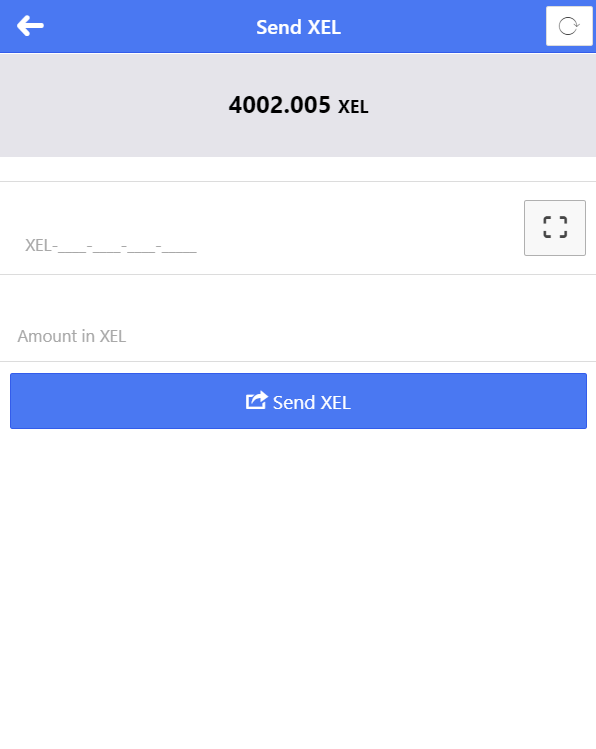
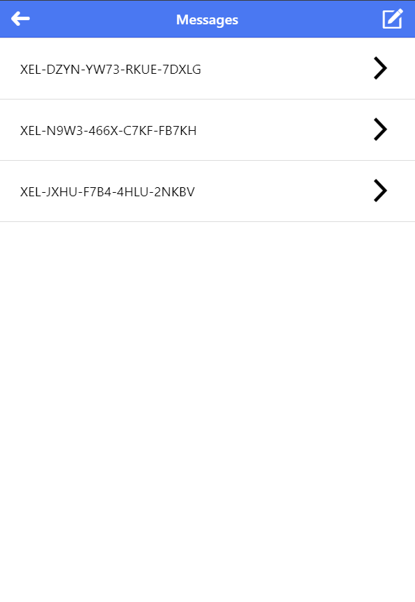
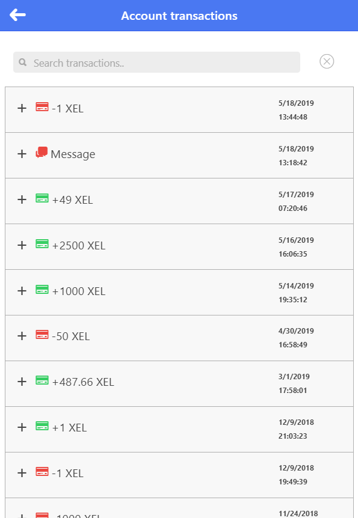

# XEL Mobile Wallet
Light weight Mobile application based on Javascript that connects to XEL blockchain. For more info on XEL blockchain visit http://xel.org

### This application supports following operations.

1. Send Xel to an recipient.

  

2. Messaging.

  

3. Account transactions.

  

4. Blockchain service

  

### Signing is done client side before broadcasting transactions.

## Download

## Run in Browser

https://tieandsuit.github.io/XEL-Mobile/
